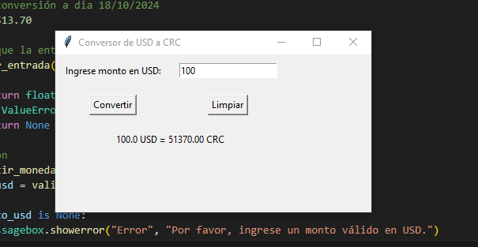
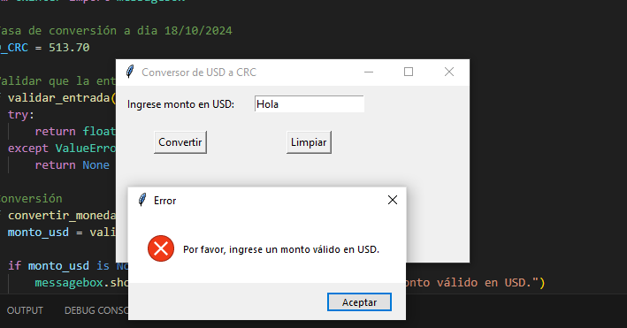
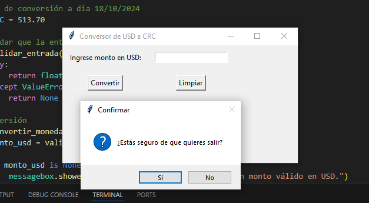

<<<<<<< Updated upstream
# conversorUnidades.
Repositorio correspondiente al quiz 2 de el curso de programación con temática de un conversor simple de dólares a colones.
=======
# Aplicación Conversor de Dolares-Colones
Este código crea una ventana con las funciones de realizar una conversión simple de dolares a colones con el tipo de campi del dia 18/10/2024

## Modo de uso 
 1. Tiene que tener instalado la biblioteca tkinter en su computadora.
 2. La terminal tiene que estar en el mismo directorio donde se encuentra el archivo .py para poder ejecutarlo.
 3. Una vez que inicie el programa le aparecera una ventana donde dice que ingrese el monto de USD, que solo pueden ser numeros, a convertir y le da al boton de Convertir. 
 4. En caso de un error al ingresar un caracter diferente a uno numerico presione el boton de Limpiar.

## Ejemplo de ejecución

 ### Conversión regular con resultado esperado.
 

 ### Valor inválido ingresado para la conversión con el mensaje de error.
 

 ### Ventana emergente al cerrar la ventana.
 
>>>>>>> Stashed changes
